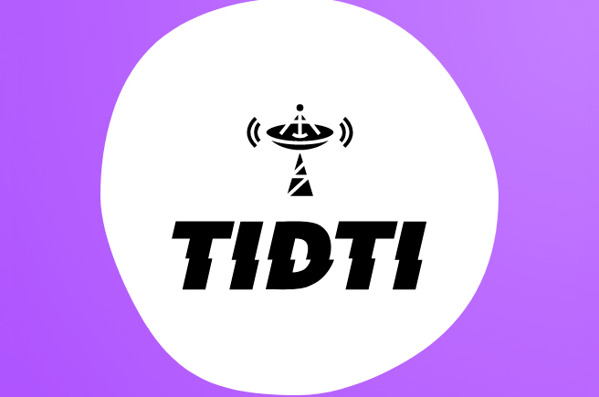

[![Stargazers][stars-shield]][stars-url]
[![LinkedIn][linkedin-shield]][linkedin-url]

<!-- PROJECT LOGO -->
 

  

<h3 align="center">TiDTi</h3>

  

    Aplicación para ver la TDT de España 🇪🇸
     
  

<h2> Historia </h2>
 - La aplicación está hecha para poder ver la Televisión Española desde una simple APP, en la cual aún no está terminada, pero voy actualizándola con nuevas novedades, y nuevos canales.
 
 <h2> Cosas Por Hacer </h2>
 - Canales Comunidades Autónomas. Actualmente: 
   ⭐ Andalucía
 
 Faltan:  
   ⛔ Aragón 
   ⛔ Canarias 
   ⛔ Cantabria 
   ⛔ Castilla La Mancha 
   ⛔ Castilla y León 
   ⛔ Cataluña 
   ⛔ Madrid 
   ⛔ Comunidad Foral de Navarra 
   ⛔ Comunidad Valenciana 
   ⛔ Extremadura 
   ⛔ Galicia 
   ⛔ Islas Baleares 
   ⛔ La Rioja 
   ⛔ Melilla 
   ⛔ País Vasco  
   ⛔ Región de Murcia 
   
 
 <h2> Novedades </h2>
  - Poder pasar de canal con el mando, pulsando el botón derecho del PAD.
  - Cada 24 Horas aproximadamente, quedará guardado el canal internamente en la app, haciendo posible que no haga falta cargarla cada vez que entremos en él. Si nos caduca el enlace, la app volverá a encontrar de nuevo el canal para poder reproducirlo.

[stars-shield]: https://img.shields.io/github/stars/pablobaro/TiDTi.svg?style=for-the-badge
[stars-url]: https://github.com/pablobaro/TiDTi/stargazers

[Java.js]: https://img.shields.io/badge/Java-ED8B00?style=for-the-badge&logo=java&logoColor=white
[Java-url]: https://www.java.com/es/

[Android.js]: https://img.shields.io/badge/Android_Studio-3DDC84?style=for-the-badge&logo=android-studio&logoColor=white
[Android-url]: https://developer.android.com/studio?hl=es&gclid=CjwKCAjw3qGYBhBSEiwAcnTRLua2XlxHNfrVHPP-bKpkbGrDOxyIT637gq5e5HuRenKHk-qpf5eSThoCrM0QAvD_BwE&gclsrc=aw.ds

[linkedin-shield]: https://img.shields.io/badge/-LinkedIn-black.svg?style=for-the-badge&logo=linkedin&colorB=555
[linkedin-url]: https://www.linkedin.com/in/pablobaroparra/
