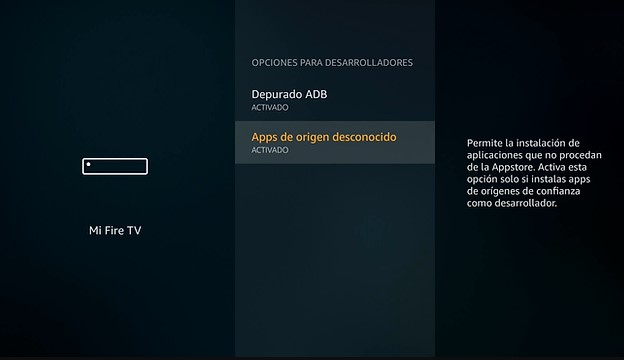
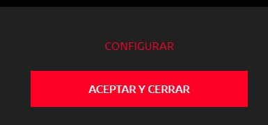
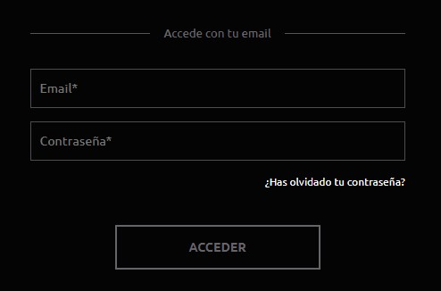

[![Stargazers][stars-shield]][stars-url]
[![LinkedIn][linkedin-shield]][linkedin-url]

<!-- PROJECT LOGO -->
 

  

<h3 align="center">TiDTi</h3>

  

    Aplicación para ver la TDT de España 🇪🇸
     
  

<h2> Historia </h2>
 - La aplicación está hecha para poder ver la Televisión Española desde una simple APP, en la cual aún no está terminada, pero voy actualizándola con nuevas novedades, y nuevos canales.
 
<h1>AtresPlayer</h1>
A partir de Febrero de 2023, AtresPlayer ha puesto más complicado el ver su aplicación, la única solución viable que he visto ha sido la siguiente. 
- Instalar la aplicación de ratón virtual en el FireStick desde la APP downloader que proporciona Amazon: <a href="http://bit.ly/3xAtKtI">Descargar</a>. 
- Una vez instalada, y teniéndo los permisos de depuración y ADB en los ajustes del FireTV, podremos usar un ratón virtual dentro de la aplicación. 
 
- Dentro de la App accedemos a Antena 3 o La Sexta, o cualquiera de AtresPlayer, y se nos abrirá la ventana de AtresPlayer. Ahora teniendo el ratón virtual, podremos movernos por la pantalla, dándole al botón de Play/Pause del FireStick 2 veces seguidas. 
- Le damos a aceptar términos de AtresPlayer 

- Y seguidamente, le damos a Acceder Gratis.

- Obviamente, si nos registramos en AtresPlayer desde el móvil, nos será más fácil iniciar sesión en la app.
- Una vez estemos ya iniciados sesión, lo más fácil sería salir a la pantalla principal donde nos aparecen todos los canales, y le demos a reproducir, y haciendo eso, ya tendremos de nuevo los canales de AtresPlayer funcionales.

 <h2> Cosas Por Hacer </h2>
 - Canales Comunidades Autónomas. Actualmente: 
   ⭐ Andalucía 
   ⭐ Aragón 
 
 Faltan:  
   ⛔ Canarias 
   ⛔ Cantabria 
   ⛔ Castilla La Mancha 
   ⛔ Castilla y León 
   ⛔ Cataluña 
   ⛔ Madrid 
   ⛔ Comunidad Foral de Navarra 
   ⛔ Comunidad Valenciana 
   ⛔ Extremadura 
   ⛔ Galicia 
   ⛔ Islas Baleares 
   ⛔ La Rioja 
   ⛔ Melilla 
   ⛔ País Vasco 
   ⛔ Región de Murcia 
   
 
 <h2> Novedades </h2>
  - Poder pasar de canal con el mando, pulsando el botón derecho o izquierdo del PAD. 
  - Cada 24 Horas aproximadamente, quedará guardado el canal internamente en la app, haciendo posible que no haga falta cargarla cada vez que entremos en él. Si nos caduca el enlace, la app volverá a encontrar de nuevo el canal para poder reproducirlo. 
  - La aplicación hará falta instalarla solo por primera vez, la app cuando encuentre actualizaciones (que se subirán aquí en github), se nos actualizará la app sola.

<h2>Próximas actualizaciones</h2>
  - Multi-Hilo para ir cargando los canales en segundo plano e intentar evitar la pantalla de carga. 
  - Mejorar movimiento dentro de la aplicación. 
  - Mostrar Guía de la Programación de cada canal. 
  - Mostrar barra de tiempo con duración de cada programa actual del canal.

[stars-shield]: https://img.shields.io/github/stars/pablobaro/TiDTi.svg?style=for-the-badge
[stars-url]: https://github.com/pablobaro/TiDTi/stargazers

[Java.js]: https://img.shields.io/badge/Java-ED8B00?style=for-the-badge&logo=java&logoColor=white
[Java-url]: https://www.java.com/es/

[Android.js]: https://img.shields.io/badge/Android_Studio-3DDC84?style=for-the-badge&logo=android-studio&logoColor=white
[Android-url]: https://developer.android.com/studio?hl=es&gclid=CjwKCAjw3qGYBhBSEiwAcnTRLua2XlxHNfrVHPP-bKpkbGrDOxyIT637gq5e5HuRenKHk-qpf5eSThoCrM0QAvD_BwE&gclsrc=aw.ds

[linkedin-shield]: https://img.shields.io/badge/-LinkedIn-black.svg?style=for-the-badge&logo=linkedin&colorB=555
[linkedin-url]: https://www.linkedin.com/in/pablobaroparra/
